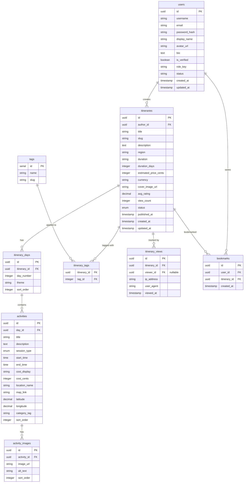

# Database Schema — Vietnam Itinerary Platform

> Derived from the current SvelteKit frontend running at `localhost:5173`.  
> Target DB: **PostgreSQL 15+** (recommended). All SQL uses PG syntax.

---

## ER Diagram



---

## Tables

### 1. `users`

Supports the **Author Card** on the detail page and the **Leaderboard** contributor names.

```sql
CREATE TABLE users (
    id              UUID PRIMARY KEY DEFAULT gen_random_uuid(),
    username        VARCHAR(50)  NOT NULL UNIQUE,
    email           VARCHAR(255) NOT NULL UNIQUE,
    password_hash   VARCHAR(255) NOT NULL,
    display_name    VARCHAR(100),
    avatar_url      TEXT,
    bio             TEXT,
    is_verified     BOOLEAN      NOT NULL DEFAULT FALSE,
    role_key        VARCHAR(30)  NOT NULL DEFAULT 'user',
    status          VARCHAR(20)  NOT NULL DEFAULT 'active',
    created_at      TIMESTAMPTZ  NOT NULL DEFAULT now(),
    updated_at      TIMESTAMPTZ  NOT NULL DEFAULT now()
);

CREATE INDEX idx_users_username ON users (username);
CREATE INDEX idx_users_email    ON users (email);
```

**FE Mapping:**
- Detail page → "Curated By" card: `display_name`, `avatar_url`, `bio`, `is_verified`
- Leaderboard → contributor: `username` / `display_name`
- Explore page → profile avatar in top bar

---

### 2. `itineraries`

The **core entity**. Maps to Explore feed cards, Create form, Detail hero, and Leaderboard items.

```sql
CREATE TYPE itinerary_status AS ENUM ('draft', 'published', 'archived');

CREATE TABLE itineraries (
    id                   UUID PRIMARY KEY DEFAULT gen_random_uuid(),
    author_id            UUID         NOT NULL REFERENCES users(id) ON DELETE CASCADE,
    title                VARCHAR(200) NOT NULL,
    slug                 VARCHAR(220) NOT NULL UNIQUE,
    description          TEXT,
    region               VARCHAR(50)  NOT NULL,       -- 'North', 'Central', 'South'
    duration             VARCHAR(50)  NOT NULL,        -- display string: "7 Days"
    duration_days        INTEGER      NOT NULL DEFAULT 1,
    estimated_price_cents INTEGER,                     -- $350 → 35000
    currency             VARCHAR(3)   NOT NULL DEFAULT 'USD',
    cover_image_url      TEXT,
    avg_rating           NUMERIC(2,1) DEFAULT 0.0,
    view_count           INTEGER      NOT NULL DEFAULT 0,  -- denormalized counter
    status               itinerary_status NOT NULL DEFAULT 'draft',
    published_at         TIMESTAMPTZ,
    created_at           TIMESTAMPTZ  NOT NULL DEFAULT now(),
    updated_at           TIMESTAMPTZ  NOT NULL DEFAULT now()
);

CREATE INDEX idx_itineraries_author   ON itineraries (author_id);
CREATE INDEX idx_itineraries_region   ON itineraries (region);
CREATE INDEX idx_itineraries_status   ON itineraries (status);
CREATE INDEX idx_itineraries_views    ON itineraries (view_count DESC);
CREATE INDEX idx_itineraries_slug     ON itineraries (slug);
CREATE INDEX idx_itineraries_published ON itineraries (published_at DESC)
    WHERE status = 'published';
```

**FE Mapping:**

| FE Feature | Column(s) |
|---|---|
| Explore card title | `title` |
| Explore card image | `cover_image_url` |
| Explore card price | `estimated_price_cents` + `currency` |
| Explore card rating | `avg_rating` |
| Explore card views | `view_count` |
| Region filter chips | `region` |
| Create form → Title | `title` |
| Create form → Region | `region` |
| Create form → Duration | `duration`, `duration_days` |
| Create form → Cover Image | `cover_image_url` |
| Save Draft / Publish | `status` |
| Detail hero | `title`, `description`, `cover_image_url`, `duration` |
| Detail sidebar price | `estimated_price_cents`, `currency` |
| Leaderboard ranking | `view_count` (ORDER BY DESC) |
| Trending section | `view_count` + `published_at` (hot algorithm) |

---

### 3. `itinerary_days`

One row per day in the itinerary. Maps to the "Day 1", "Day 2" sections in both Create and Detail pages.

```sql
CREATE TABLE itinerary_days (
    id             UUID PRIMARY KEY DEFAULT gen_random_uuid(),
    itinerary_id   UUID        NOT NULL REFERENCES itineraries(id) ON DELETE CASCADE,
    day_number     INTEGER     NOT NULL,
    theme          VARCHAR(200),       -- "Arrival & Exploration"
    sort_order     INTEGER     NOT NULL DEFAULT 0,

    UNIQUE (itinerary_id, day_number)
);

CREATE INDEX idx_days_itinerary ON itinerary_days (itinerary_id, sort_order);
```

**FE Mapping:**
- Create form → "Day {n}" header + optional theme input
- Detail page → "Day 1" / "Hanoi to Ha Giang City" subtitle

---

### 4. `activities`

Individual activities within a day. Maps to the timeline cards in both Create form and Detail page.

```sql
CREATE TYPE session_type AS ENUM ('morning', 'lunch', 'afternoon', 'evening');

CREATE TABLE activities (
    id              UUID PRIMARY KEY DEFAULT gen_random_uuid(),
    day_id          UUID         NOT NULL REFERENCES itinerary_days(id) ON DELETE CASCADE,
    title           VARCHAR(200) NOT NULL,
    description     TEXT,
    session_type    session_type,                     -- drives color accent on FE
    start_time      TIME,
    end_time        TIME,
    cost_display    VARCHAR(50),                       -- "~ $12 / person", "Included"
    cost_cents      INTEGER,                           -- structured cost for calculations
    location_name   VARCHAR(200),                      -- "Tuyen Quang", "Basecamp HQ"
    map_link        TEXT,                              -- Google Maps URL
    latitude        NUMERIC(10,7),
    longitude       NUMERIC(10,7),
    category_tag    VARCHAR(50),                       -- "Transport", "Dining", "Preparation"
    sort_order      INTEGER NOT NULL DEFAULT 0
);

CREATE INDEX idx_activities_day ON activities (day_id, sort_order);
```

**FE Mapping:**

| FE Feature | Column(s) |
|---|---|
| Create form → Activity Title input | `title` |
| Create form → Description textarea | `description` |
| Create form → Start/End time pickers | `start_time`, `end_time` |
| Create form → Cost input | `cost_display`, `cost_cents` |
| Create form → Google Maps link | `map_link` |
| Detail → session color (Morning/Lunch/Afternoon) | `session_type` |
| Detail → time label "07:00 AM - 01:00 PM" | `start_time`, `end_time` |
| Detail → category pill "Transport" / "Dining" | `category_tag` |
| Detail → cost footer "~ $12 / person" | `cost_display` |
| Detail → "Open in Google Maps" button | `map_link` |
| Detail → activity card description | `description` |

---

### 5. `activity_images`

Supports the **image gallery grids** on activity cards in the Detail page (2-col and 3-col grids).

```sql
CREATE TABLE activity_images (
    id            UUID PRIMARY KEY DEFAULT gen_random_uuid(),
    activity_id   UUID    NOT NULL REFERENCES activities(id) ON DELETE CASCADE,
    image_url     TEXT    NOT NULL,
    alt_text      TEXT,
    sort_order    INTEGER NOT NULL DEFAULT 0
);

CREATE INDEX idx_activity_images ON activity_images (activity_id, sort_order);
```

---

### 6. `tags` + `itinerary_tags`

Powers the **tag chips** on Explore cards (e.g., "North", "Adventure", "Motorbike") and supports search/filter.

```sql
CREATE TABLE tags (
    id    SERIAL PRIMARY KEY,
    name  VARCHAR(50) NOT NULL UNIQUE,
    slug  VARCHAR(50) NOT NULL UNIQUE
);

CREATE TABLE itinerary_tags (
    itinerary_id UUID    NOT NULL REFERENCES itineraries(id) ON DELETE CASCADE,
    tag_id       INTEGER NOT NULL REFERENCES tags(id) ON DELETE CASCADE,
    PRIMARY KEY (itinerary_id, tag_id)
);

CREATE INDEX idx_itinerary_tags_tag ON itinerary_tags (tag_id);
```

**Seed data:**
```sql
INSERT INTO tags (name, slug) VALUES
    ('North', 'north'),
    ('Central', 'central'),
    ('South', 'south'),
    ('Adventure', 'adventure'),
    ('Motorbike', 'motorbike'),
    ('Beach', 'beach'),
    ('Culture', 'culture'),
    ('Nature', 'nature'),
    ('Boat', 'boat'),
    ('Food', 'food');
```

---

### 7. `itinerary_views`

Granular view tracking for the **Leaderboard** ranking and the view counts shown across the app.

```sql
CREATE TABLE itinerary_views (
    id             UUID PRIMARY KEY DEFAULT gen_random_uuid(),
    itinerary_id   UUID        NOT NULL REFERENCES itineraries(id) ON DELETE CASCADE,
    viewer_id      UUID                 REFERENCES users(id) ON DELETE SET NULL,
    ip_address     INET,
    user_agent     TEXT,
    viewed_at      TIMESTAMPTZ NOT NULL DEFAULT now()
);

CREATE INDEX idx_views_itinerary   ON itinerary_views (itinerary_id);
CREATE INDEX idx_views_viewer      ON itinerary_views (viewer_id) WHERE viewer_id IS NOT NULL;
CREATE INDEX idx_views_viewed_at   ON itinerary_views (viewed_at DESC);
```

> [!TIP]
> Use `itineraries.view_count` as a **denormalized counter** for fast reads (Explore cards, Leaderboard).  
> Increment it atomically via a trigger or application-level `UPDATE ... SET view_count = view_count + 1` on each view insert.  
> The `itinerary_views` table provides granular analytics (trending algorithms, unique viewers, etc.).

---

### 8. `bookmarks` (Future-ready)

Supports a future "Save Itinerary" feature. The Detail page already has a "Book This Itinerary" button.

```sql
CREATE TABLE bookmarks (
    id             UUID PRIMARY KEY DEFAULT gen_random_uuid(),
    user_id        UUID        NOT NULL REFERENCES users(id) ON DELETE CASCADE,
    itinerary_id   UUID        NOT NULL REFERENCES itineraries(id) ON DELETE CASCADE,
    created_at     TIMESTAMPTZ NOT NULL DEFAULT now(),

    UNIQUE (user_id, itinerary_id)
);

CREATE INDEX idx_bookmarks_user ON bookmarks (user_id, created_at DESC);
```

---

## Enums Summary

| Enum | Values | Used By |
|---|---|---|
| `itinerary_status` | `draft`, `published`, `archived` | `itineraries.status` — maps to Save Draft vs. Publish buttons |
| `session_type` | `morning`, `lunch`, `afternoon`, `evening` | `activities.session_type` — drives the Blue/Green/Terracotta color accents |

---

## Key Indexes Strategy

| Purpose | Index |
|---|---|
| Explore feed (latest published) | `idx_itineraries_published` (partial, WHERE status='published') |
| Region filter | `idx_itineraries_region` |
| Leaderboard ranking | `idx_itineraries_views` (DESC) |
| Trending algorithm | `idx_views_viewed_at` + time-windowed COUNT |
| Author's itineraries | `idx_itineraries_author` |
| Full-text search | Consider adding `tsvector` column with GIN index on `itineraries.title + description` |

---

## Page → Query Mapping

### Explore (`/`)
```sql
-- Trending Itineraries (top N by recent views or hot algorithm)
SELECT i.*, u.display_name, u.avatar_url
FROM itineraries i
JOIN users u ON u.id = i.author_id
WHERE i.status = 'published'
ORDER BY i.view_count DESC
LIMIT 10;

-- Region-filtered feed
SELECT i.*, u.display_name
FROM itineraries i
JOIN users u ON u.id = i.author_id
WHERE i.status = 'published'
  AND ($1 = 'All Regions' OR i.region = $1)
ORDER BY i.published_at DESC;
```

### Create (`/create`)
```sql
-- Insert itinerary
INSERT INTO itineraries (author_id, title, slug, region, duration, duration_days, status)
VALUES ($1, $2, $3, $4, $5, $6, 'draft')
RETURNING id;

-- Insert days + activities in a transaction
INSERT INTO itinerary_days (itinerary_id, day_number, theme, sort_order) ...
INSERT INTO activities (day_id, title, description, start_time, end_time, ...) ...

-- Publish
UPDATE itineraries SET status = 'published', published_at = now() WHERE id = $1;
```

### Detail (`/itineraries/:id`)
```sql
-- Full itinerary with author
SELECT i.*, u.display_name, u.avatar_url, u.bio, u.is_verified
FROM itineraries i
JOIN users u ON u.id = i.author_id
WHERE i.slug = $1 AND i.status = 'published';

-- Days with activities
SELECT d.*, a.*, ai.image_url, ai.alt_text
FROM itinerary_days d
LEFT JOIN activities a ON a.day_id = d.id
LEFT JOIN activity_images ai ON ai.activity_id = a.id
WHERE d.itinerary_id = $1
ORDER BY d.sort_order, a.sort_order, ai.sort_order;
```

### Leaderboard (`/leaderboard`)
```sql
SELECT i.id, i.title, i.cover_image_url, i.view_count,
       u.display_name, u.username
FROM itineraries i
JOIN users u ON u.id = i.author_id
WHERE i.status = 'published'
ORDER BY i.view_count DESC
LIMIT 20;
```

---

## Future Extensibility

> [!NOTE]
> The following tables are **not yet needed** by the current FE but are natural extensions based on existing UI hints:

| Feature | UI Hint | Suggested Table |
|---|---|---|
| **Ratings & Reviews** | Star rating on Explore cards, `avg_rating` column | `reviews (id, itinerary_id, user_id, rating, comment, created_at)` |
| **Bookings** | "Book This Itinerary" button on Detail sidebar | `bookings (id, user_id, itinerary_id, status, booked_at, ...)` |
| **Comments** | Natural community feature | `comments (id, itinerary_id, user_id, body, created_at)` |
| **Likes** | Leaderboard `likes` field in mock data | `likes (user_id, itinerary_id, created_at)` |
| **User Points** | Leaderboard mock has `points` per user | `user_stats (user_id, total_points, total_likes, ...)` |
| **Essential Services** | Sidebar "Motorcycle Rental" / "Travel Insurance" cards | `services (id, name, description, icon, category)` |
| **Search** | Search bar on Explore | PostgreSQL `tsvector` + GIN index, or Typesense/Meilisearch |
